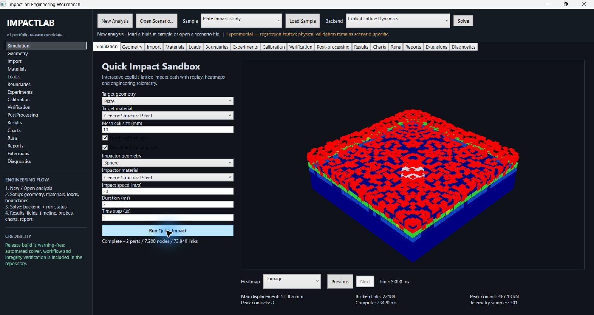

<p align="center">
  
</p>

# ImpactLab

[English](README.md)

**Darbe simülasyonu, continuum mechanics, termal bağlaşım, deneyler ve tekrarlanabilir doğrulama için yerel bir Windows mühendislik çalışma ortamı.**

ImpactLab, bir mühendislik senaryosunu izlenebilir bir akışa dönüştürür: geometri ve malzemeleri tanımlama, yük ve sınır koşullarını uygulama, sayısal backend seçme, çözme, alanları ve probe’ları inceleme, deneyleri karşılaştırma ve deterministik rapor paketi üretme. Masaüstü kabuğu WPF’tir; sayısal ve iş akışı katmanları yeniden kullanılabilir .NET kütüphanelerine ve yalıtılmış worker process’lerine ayrılmıştır.

> Lise yıllarımda başladığım kişisel bir mühendislik projesi. Sertifikalı bir FEA ürünü veya doğrulanmış ticari solver’ların yerine geçen bir araç olarak değil, deneysel bir çalışma ortamı ve öğrenme platformu olarak yayımlanıyor.



*Gerçek Release-build görüntüsü: tamamlanmış bir Quick Impact Sandbox çalışmasının 3B sonuç görünümü. Görüntü fiziksel doğruluk kanıtı değildir.*

## Mühendislik açısından içeriği

- Birden fazla analiz yolu: explicit lattice impact, linear-static tetrahedral continuum, transient dynamics, nonlinear/finite-strain temelleri ve thermo-mechanical coupling.
- UI mock-up’ının ötesinde mekanik bileşenler: sparse CSR matrisler, iterative solver’lar, tetrahedral assembly, J2 plasticity, Neo-Hookean malzeme cevabı, penalty/friction contact ve enerji tanıları.
- Senaryo migration, mesh import/repair, parameter sweep, uncertainty ve optimization araçları, result streaming, probe, chart, report ve run archive içeren ürün yüzeyi.
- Deney worker’ları ve güvenilmeyen extension’lar için sürümlenmiş IPC sözleşmeleriyle process sınırları; açık güven ve uyumluluk kuralları.
- Mimariye dâhil edilmiş doğrulama: analitik benchmark’lar, referans sinyal karşılaştırması, şema migration testleri, deterministik rapor kontrolleri, bütünlük denetimleri ve CI kanıt dosyaları.

## Çalışma ortamı nasıl kuruldu?

Senaryo, ürün arayüzü ile sayısal kodu birleştiren temel birimdir. WPF
uygulaması geometri, malzeme, yük, sınır koşulu ve backend ayarlarını toplar;
sürümlenmiş senaryo verisi ve migration’lar kayıtlı girdilerin okunmasını
sağlar. Seçilen backend `ImpactLab.Core` üzerinden çalışır; masaüstü arayüzü
ortaya çıkan alanları, telemetriyi, probe’ları, chart’ları ve rapor/export
akışlarını sunar.

Uygulama, farklı hata ve güven profilleri olan işleri ayırır. Sayısal ve
domain kodu yeniden kullanılabilir bir kütüphanededir; parameter study’ler
yalıtılmış worker’da çalışabilir; extension’lar ayrı host ve açık uyumluluk/
güven kuralları kullanır. Analitik/referans testleri, şema fixture’ları ve
bütünlük denetimleri bu parçaları ayrı ayrı sınar. Bunlar yazılım davranışı
ve regresyon kanıtıdır; ölçülmemiş gerçek bir darbenin fiziksel doğruluğu
anlamına gelmez.

## Doğrulanmış durum

Mevcut Windows release adayı .NET 8 ile; analyzer’lar ve warnings-as-errors açıkken kaynaktan yeniden build edildi.

| Kapı | Sonuç |
| --- | --- |
| Release solution build | **Geçti — 0 uyarı, 0 hata** |
| xUnit testleri | **Geçti — 111/111** |
| Kaynak biçimi | **Geçti — 1.171 dosya kontrol edildi** |
| Taşınabilir bütünlük denetimleri | **Geçti — 6/6** |
| WPF açılış smoke testi | **Geçti — process 8 saniye sağlıklı kaldı** |
| Etkileşimli Quick Impact | **Release uygulamasında tamamlandı — 3,000 ms simülasyon, 235 ms hesaplama, 31 telemetry örneği** |
| Yerleşik senaryo UI akışı | **Plate impact study: Load Sample → Solve → Results Explorer, Release uygulamasında tamamlandı** |
| Birlikte build edilen projeler | Core, WPF App, Worker, ExtensionHost, Extractor, MeshAdapter sample, Tests |
| GitHub Actions | **Geçti** — Windows bütünlük denetimleri, biçim kontrolü, Release build ve testler [yayımlanmış workflow koşusunda](https://github.com/AkifAydemir/ImpactLab/actions/runs/35299671087) tamamlandı |

Komutlar ve iddia sınırları için [doğrulama ayrıntılarına](docs/VALIDATION.md) bakın. Sonraki push’ların durumunu [güncel koşulardan](https://github.com/AkifAydemir/ImpactLab/actions) kontrol edin. Güncel masaüstü paket sürümü: **1.0.0**.

## Kısa mimari görünüm

```text
WPF workbench
  ├─ scenario authoring and schema migration
  ├─ geometry, materials, loads, boundaries
  ├─ solve orchestration and backend registry
  └─ results, probes, charts, reports, archives
                    │
                    ▼
               ImpactLab.Core
  ├─ lattice + tetrahedral continuum mechanics
  ├─ contact + constitutive laws + thermal coupling
  ├─ sparse solvers + numerical diagnostics
  └─ experiments + verification + persistence
          │                         │
          ▼                         ▼
 isolated experiment worker    isolated extension host
```

Daha ayrıntılı bağımlılık ve veri akışı için [mimari notlarına](docs/ARCHITECTURE.md) bakın.

## Doğrulanmış etkileşimli başlangıç

1. Windows Release uygulamasında **Simulation → Quick Impact Sandbox** bölümünü açın.
2. **Mesh cell size** değerini `20 mm`, **Time step** değerini `20 µs` yapın; diğer varsayılan girdileri değiştirmeyin.
3. **Run Quick Impact** seçeneğini çalıştırın. Yukarıdaki gerçek yakalamada 3B sahne ve 31 telemetry örneği oluştu.

İkinci bir UI akışı için yerleşik **Plate impact study** örneğini seçin, **Explicit Lattice Dynamics** backend’ini koruyun ve **Solve** seçeneğine basın. Release uygulaması bu kaba çözünürlüklü örneği tamamlayıp `15` numaralı karede **Results Explorer** bölümünü açtı. Bu gözlem iş akışı geçişini ve sonuç satırlarının oluşmasını doğrular; anlamlı bir darbe cevabı veya fiziksel doğruluk iddiası taşımaz. Daha açıklayıcı ürün görüntüsü yukarıdaki Quick Impact ekranıdır.

## Hızlı başlangıç

Gereksinimler: Windows 10/11 ve .NET 8 SDK.

```powershell
dotnet restore .\ImpactLab.sln
dotnet build .\ImpactLab.sln -c Release --no-restore
dotnet test .\ImpactLab.sln -c Release --no-build
dotnet run --project .\src\ImpactLab.App\ImpactLab.App.csproj -c Release
```

Repo’nun kanıt üreten doğrulama yolu:

```powershell
dotnet tool restore
dotnet tool run csharpier check .
.\eng\verify.ps1
```

Kısa canlı demo için yukarıdaki doğrulanmış Quick Impact yolunu kullanın. Yerleşik senaryo akışı ve sınırları [doğrulama ayrıntılarında](docs/VALIDATION.md) kayıtlıdır.

## Repo yapısı

| Yol | Görev |
| --- | --- |
| `src/ImpactLab.Core` | Sayısal çekirdekler, domain modelleri, backend’ler, deneyler, sonuçlar, persistence, doğrulama |
| `src/ImpactLab.App` | Windows/WPF mühendislik çalışma ortamı |
| `src/ImpactLab.Worker` | Yalıtılmış parameter-study yürütmesi |
| `src/ImpactLab.ExtensionHost` | Process dışı extension sınırı |
| `tests/ImpactLab.Core.Tests` | Birim, sayısal sözleşme, güvenlik, migration ve iş akışı testleri |
| `eng` | Release doğrulaması ve taşınabilir bütünlük denetimleri |
| `samples` | Senaryo, mesher sözleşmesi, erişilebilirlik, extension-policy ve rapor örnekleri |
| `docs` | Güncel mimari/doğrulama notları ve sürümlenmiş tasarım geçmişi |

Küçük ve incelenebilir değişiklikler için yerel kalite kapıları [CONTRIBUTING.md](CONTRIBUTING.md) dosyasında yer alır.

## Kapsam ve sınırlamalar

ImpactLab yazılım mimarisi ve sayısal mühendislik pratiğini gösterir. Geçen testler, uygulanan sözleşmelerin ve dâhil edilen analitik/referans vakaların beklenen şekilde davrandığını gösterir; rastgele gerçek yapıların davranışını öngörme doğruluğunu **kanıtlamaz**. Üretim kullanımında mesh/time-step yakınsama çalışmaları, deneysel korelasyon, daha geniş eleman ve contact doğrulaması, malzeme kalibrasyonu ve bağımsız inceleme gerekir.

Bu sınır bilinçlidir: proje varsayımları ve kanıtı etkileyici ekran görüntülerinin arkasına saklamamayı amaçlar.

## Lisans

[MIT Lisansı](LICENSE) altında yayımlanır.
